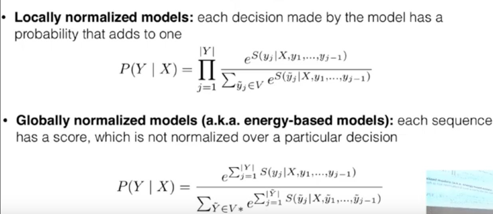
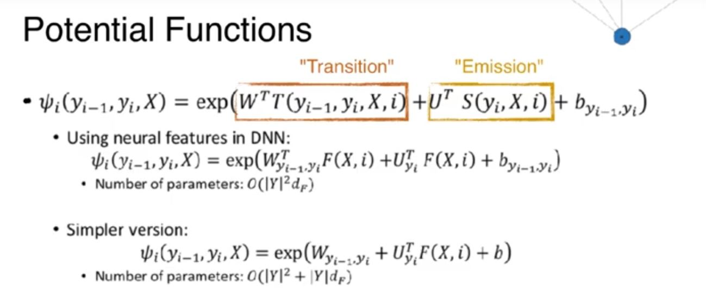
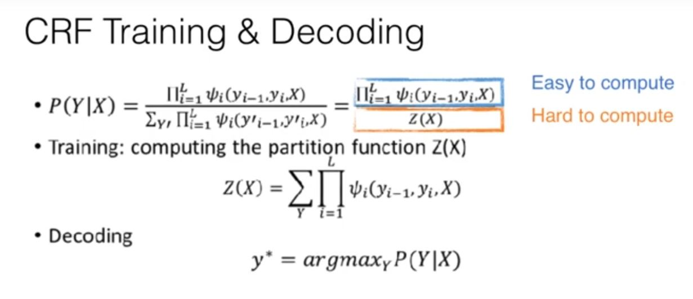

# Structured Independence with Local Independence Assumptions
- Prediction types 
    - Binary Classification
    - Multi Class Classification
    - Structure prediction (Infinite labels)
- "Structured" prediction because classes are too numerous to enumerate. 
    - Need methods to exploit problem structure.
- Sequence Labeling: One tag for one word; Eg: POS Tagging, NER
- Consistency in outputs is important and this can hints on how to create better models.
- Factor graphs are defining dependencies.
- Problems:
    - Independent Classification models
        - Strong independence assumptions
        - No guarantee of consistency
    - Seq2Seq models
        - Can't calculate exactly
        - No independence assumption
        - Exposure Bias
            - While training it receives correct input(ground truth labels), but while testing it receives the output from the decoders and this introduces as an error which propagates through the system.

## Conditional Random Fields
 - Some Independent assumption with local dependencies
- Therefore can use exact decoding techniques with dynamic programs
- Local Normalization Vs global Normalization
    
    - The Globally Normalized value is intractable
- Conditional Random Fields(CRFs) 
    - Global Models assume dependencies between random parts over the entire space
    - CRFs assume local dependencies
    - First order linear CRFs assume neighboring dependencies (For eg: POS tags one after another)

    - Each has a transition and emission part. 

- The calculations are exponential and also need us to enumerate.
- Each labels depend on the input and nearby labels, but given adjacent labels nearby ones do not matter.
- A dynamic program can be used to calculate the partition function. Z(X)   
    - The way the CRF would be trained is you take the log score of the true path and subract from Z(X), to calculate the global log likelihood which is then used as a loss function.

- Argmax Search (Viterbi algorithm)
    - Instead of using log_sum_exp over in the dynamic program, use max and argmax.

## BiLSTM-CNN-CRF for Sequence Labeling (Ma et al 2016)
- Building end to end neural models for sequence labeling
- Two levels of representations
    - Character Level Representation: CNN
    - Word Level representation: BiLSTM
- CNN run over each character and max pool to get representation of each word.
- Concatenated with word representations and feeded into model.
