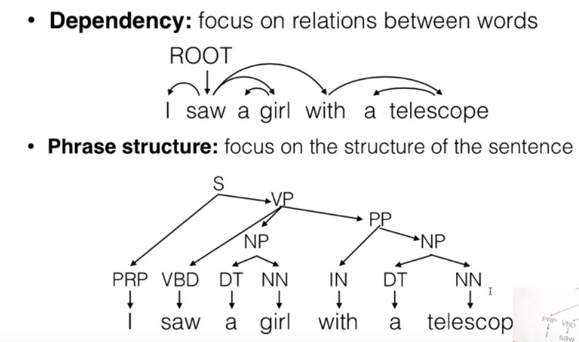
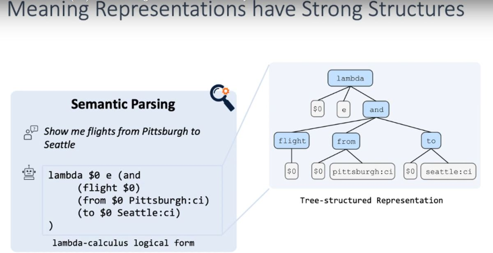
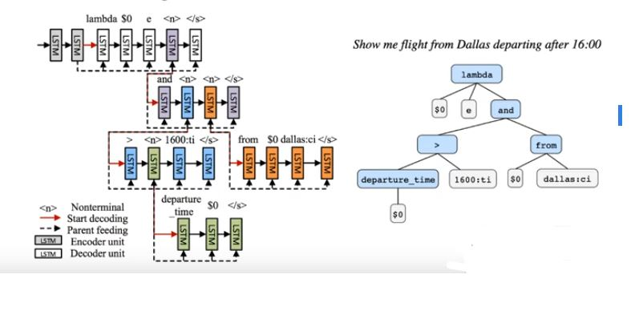
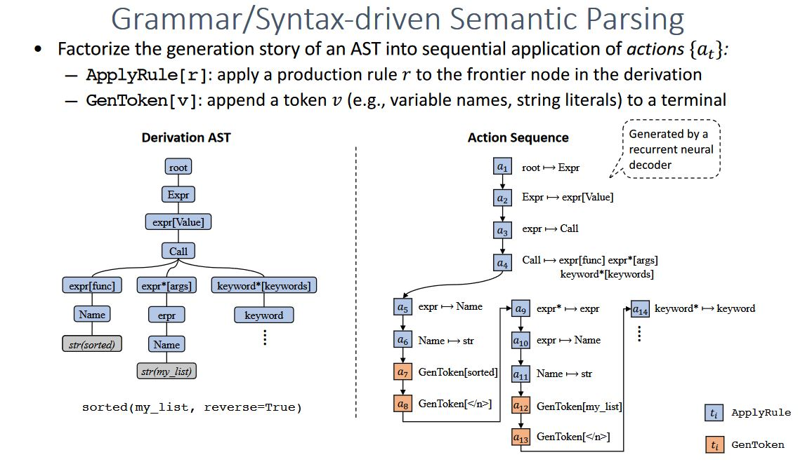

# Transition Based Parsing with Neural Networks
- Two common type of trees
    - Syntax trees
    - Semantic trees
- Two common types of linguistic structure 
    - Dependency
    - Phrase structure

## Parsing
- Predicting linguistic structure from input sentence
- Transition-based Models
- Graph Based Models

### Shift-Reduce Dependency Parsing
- Dependencies are often good for semantic tasks.
- It is possible to create labeled dependencies that show relations b/w words. 
- Process words one-by-one L->R
- Used with Two DataStructures 
    - Queue: of unprocessed words
    - Stacks: of processed words.
- At each point, choose between shift, reduce left, reduce right and you have to choose one of these actions with a classifier.
- Configuration -> Three Class Classification
- Extract features from config, like words that exist, POS tags, (For example knowing that the first word is a noun and the second word is a verb, might reveal a relation).

### FFN model for shift reduce parsing
- Extract non-combined features (Embeddings) i.e let the NN extract and combine the features.
- Different combinations like top 3 words of the stack and queue, the children of the top words etc are fed. (The problem is these features are still extracted and then fed into the NN to make sense of them).

### Tree Structure NNs
- Tree Structure because to model the hierarchical structure of the sentence/ multiple documents and this is also important because neural networks are bad at maintaining long coherent discourses.
- Recursive Neural Networks (socher et al): Like RNNs but instead of defining over sequences its defined over trees.
- Tree Strucured LSTM (Tai et al 2015)
    - Child Sum Tree LSTM: Each LSTM has a different forget gate value for each child.
    - N-ary Tree LSTM: Different parameters for each child
- Bi-LSTM Composition (Dyer et al 2015): Lets the model learn its own composition function.
- Tree/Hierarchichal structure helps us model better inductive biases given the task in hand. That is, for certain tasks we know taking advantage of the hierarchical linguistic structure will give better performance.

### Stack LSTM
- Instead of Previous parsing method, we have one RNN encoding each stack config i.e buffer, stack and the previous actions. How is the stack modeled? Using tree NNs.

# Neural Semantic Parser
- To build natural language interfaces to AI systems.
- Parsing Natural Language utterance (eg- query) into machine executable structures. (eg: logical form, SQL, python code)

- Database query is written in a lambda calculus logical form, which can be built as tree structured representations
- Meaning Representations
    - Machine Executable MRs.
    - Meaning representations for semantic attention.
- WorkFlow of a Semantic Parser -> Natural Language Query -> Parsing to Meaning Representation -> Execute Programs against KBs -> Execution results
- Semantic Parsing Datasets 
    - DSLs -> GeoQuery, WikiSQL, IFTT
        - GeoQuery -> Geographical Information
        - ATIS -> Flight booking and airport transportation
        - Jobs -> 640 queries to job database
        - Text to SQL tasks 
            - Spider -> Examples from 200 databases, SQL queries.
    - General purpose programming languages -> Django, HearthStone
        - CoNaLa -> Natural Language queries collected from StackOverflow, 
    
## Learning NSPs
- Semantic Parsing as Seq2Seq Transduction i.e Turn this problem into a simple sequence to sequence problem
    - This doesnt work because the programs have strong underlying structures, and this could result in generation of non-syntactic outputs
- How do you add inductive biases to networks to better capture the structure of a program?
    - Encode them(input) properly
    - Predict programs which follow program structure

## Supervised Learning 
- Key Question: Design Decoders to follow the structure of programs.
- Structure-Aware Decoding for Semantic Parsing (tree based decoding)
    - Seq2Tree -> generate the parse tree of a program using a hierarchy of recurrent neural decoders
        - Decoding - Each level has terminals and non terminals, use LSTM decoder to generate sequence, each non
        

    - Structure Aware Decoding -> Coarse-To-Fine Decoding   
        - Create Global Structure first and then use it to guide fine grained structure

- Grammar/Synatax-drive Semantic Parsing (grammar constrained decoding)
    - Use the grammar of the target MR(meaning representation) eg: python AST, as prior symbolic knowledge in a neural Seq2Seq.
    - Factorize the generation of AST into sequential actions (ApplyRule, GenerateToken)
    
    
    - TranX (open source Abstract suntax parser)

## Importance of modeling copying 
- For example in AI Assistants, when given an utterance "alarm at 7:00pm", it has to copy the 7:00pm exactly and not come up with its own idea for the same.

## NonSupervised Approaches
- Supervised Learning suffers from data inefficiency issues, since neural models are data hungry.
- But collecting such rich data especially this particular case of Neural Semantic Parsing because need domain experts for annotation.
- Weekly Supervised Learning with RL 
    - Given utterance, dataset and answer, it is given an environment where in it can run programs
    - It comes up with trials, i.e hypothetical programs which are run in the environment.
    - Reward the program when it comes with programs that works.
    - The problems, are exponentially large search space, very sparse rewards, and some programs which might work but are not right.
- Improvements
    - Efficient Search
        - Use memory buffer to cache high reward logical forms
        - Bias during training to lead to high reward
    - Tackle Spurious Programs using Heuristics.

## Challenges for NSP
- Natural Language is highly compositional.
- Scale to OpenDomain Knowledge.