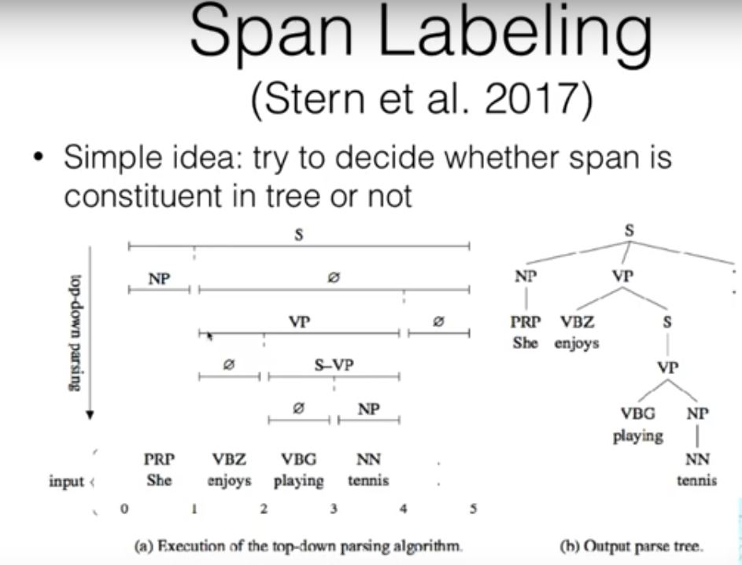

# Parsing with Dynamic Programming
- DP for Phrase Structure Parsing
    - Models to calculate phrase structure: parsing is similar to tagging(i.e we are searching in a graph for the best path)
    - Parsing is searching in a hypergraph for the best tree.
- Hyperpgraph   
    - The degree of an edge is the number of children
    - A graph is a hypergraph of degree one.
    - Eg: I saw a girl with telescope, here "a girl with a telescope" can be a noun phrase, or you might have seen "a girl" with a "telescope", there in lies the syntactic ambiguity.
- CKY Algorithm
    - Find highest scoring tree given a CFG grammar
    - Create a hypergraph containing all candidates for a binarized grammar, do hypergraph search.
    - Analagous to Viterbi but for searching trees.
- Inside-outside algorithm
    - Instead of log_sum_exp use max
- Neural CRF parsing (Durett and Klein 2015)
    - Predict score of each span using FFNN
    - Do discrete structure inference using CKY, inside-outside.
- Span Labeling (Stern et al 2017)
    

- Self Attentional Encoding + Structured Inference (kitaev 2018.)

## Dependency parsing with Dynamic Programs
- Graph Based dependency parsing
    - Express each sentence as fully connected directed graph
    - Score each edge independently
    - Find maximal spanning tree.
- While transition based easily condition on infinite tree context, but greedy search algorithms cause short term mistakes. Graph based models find exact solution through DP algorithms
- Chu-Liu-Edmond Algorithm
- Eisner's Algorithm
- Higher order dependency parsing (Zhang and Mcdonald 2012)
    - Consider multiple edges at a time when calculating scores.
    - Can extract more expressive features.

## Neural Models for Graph based Parsing
- Neural Feature Combinations (Pei et al 2015)
- BiLSTM Feature extractor
- BiAffine Classifier (Dozat,Manning 2017)
    - Learn specific representations for head/dependent for each word.