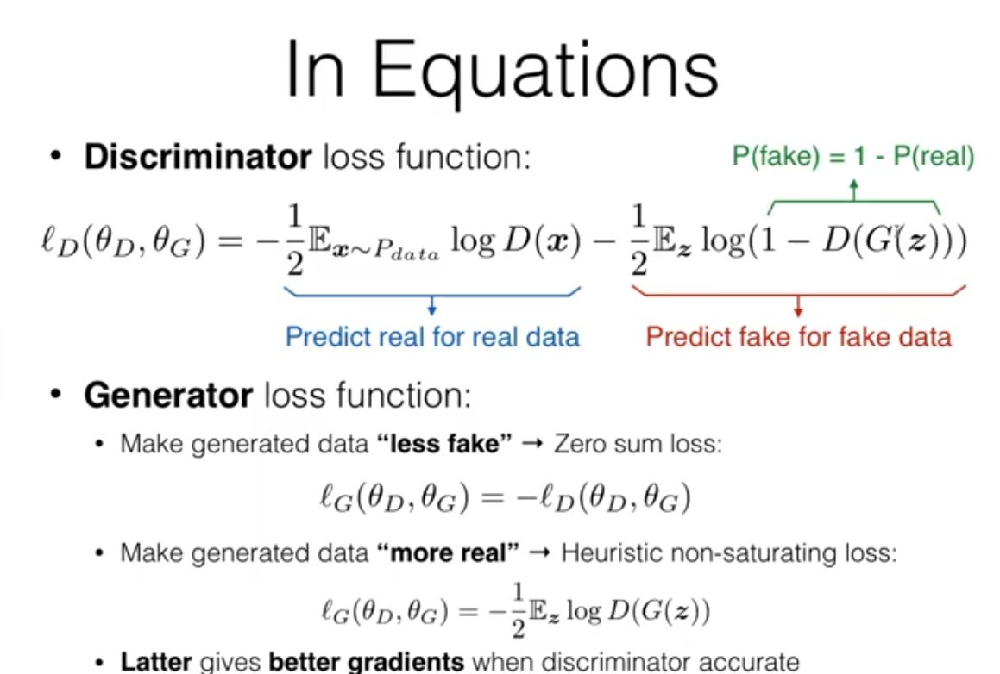

# Adversarial Methods in Natural Language Processing
- Generative models try to model a data distribution or a conditional one
- Latent variable models introduce another variable
- A perfect generative model can 
    - Evaluate likelihood (Eg: perplexity)
    - Generate Samples
    - Infer Latent Attributes (Eg Infer the topic of a sentence in a topic model)
- Non-Latent models very good at likelihood, but not good at image generation
- GANs and VAEs are very good at generation of images, and are decent at inference.
- Adversarial Methods
    - Create a discriminator that criticizes some aspect of the generated output
    - Gans criticize the generated outputs, Adversarial feature learning criticize the generated features.

## GANs
- Two models
    - Discriminator: Given an image, try to tell whether real or not
    - Generator: Tries to generate an image which fools the discriminator
- Training Method
    - Sample minibatch, xReal
    - Latent variable sampler and convert these into output, xFake
    - predict with discriminator 

- Interpretation: This can be thought of as distribution matching
- GANs are good because
    - Discriminator is like learned metric
    - Can easily pick up discrepancies
    - Generator has good signals to learn better
- GAN training is difficult
    - Convergence and stability (WGAN, Gradient-Based Regularization)
    - Mode collapse/Dropping (Mini-batch Discrimination, Unrolled GAN)
    - Overconfident Discriminator 

## Applying GANs to Text
- GANs for Language Generation (Yu et al 2017)
- GANs for MT(Gu et al 2017)
- GANs for text cant backprop through samples, to solve this use training methods for latent variables (RL, or gumbel softmax)
- Discriminator for Sequences
    - CNNs as discriminator (yu et al 2017, wu et al 2017)
- GANs for Text are hard (yang et al 2017, wu et al 2017)
- Stabilization Trick: Assigning reward to specific actions i.e reward to partial sequences (Reward Shaping)
- Stabilization Trick: Perform multiple roll outs
- Discrimination over Softmax Results (Hu et al 2017)
    - Instead of output, discriminate over softmax.

## Adversarial Feature Learning
- Adversarial feature learns over some extracted features
- Why over features? if non generative tasks or continuos reps easier than discrete
- Learning Domain-invariant Representations (ganin et al 2016)
- Learning Language Invariant Representations (chen et al 2016), Multilingual MT (Xie et al 2017)
- NOTE: The distribution of the output over the feature domain should be similar for doing adversarial feature learning 
- Adversarial Multi Task Learning( Liu et al 2017)
- Applied in Unsupervised paradigms as well for style transfer, MT etc
- What is an Adversarial Example (Michel et al 2019)
