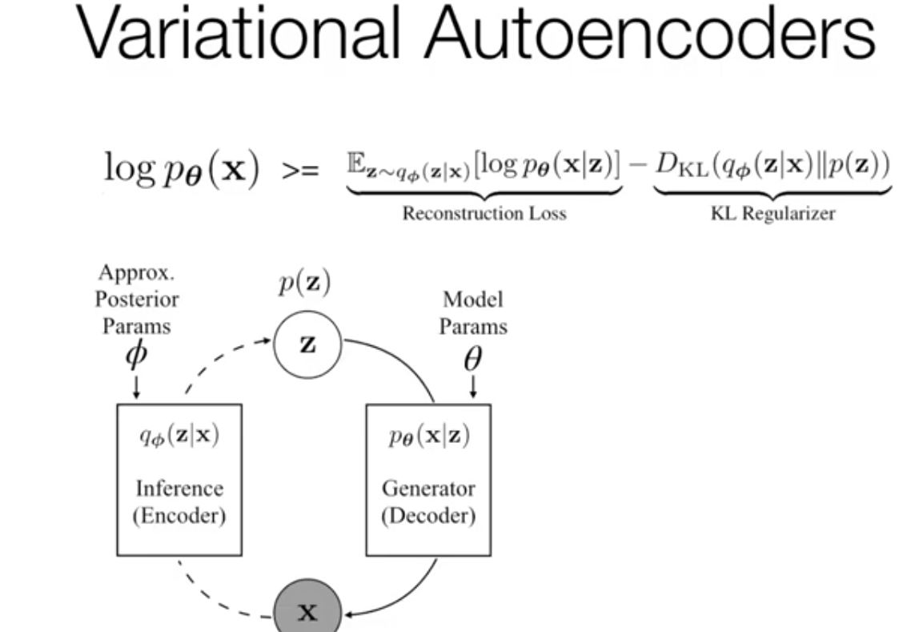

# Models with Latent Random Variables
- Discriminative models calculate probability of output given input, while generative models calculate the probability of variable or multiple variable
- Types of Variable
    - Observed vs Latent: Observed during learning time from data, Latent are those which exist but arent given a value
    - Deterministic vs Random
- Latent Variable model: is a probability distribution over two sets of variables, one set related to learning from data, another describe latent variables
- Latent Random Variable Model
    - Older: HMMs, Topic Modeling, Some Tree Structured Models
- Why Latent Variable Models
    - Because some variables are not observed naturally but something we are interested in
    - To learn interpretable structure
- Deep Structured LVM
    - Tradeoff b/w interpretability and flexibility

## Variational Autoencoders (kingma et al 2014)
- A neural network which maps from one space to another. We are learning the underlying data distribution
- From a probabilistic perspective, we model joint probability distribution
- We would like to do maximizer log likelihood, but difficult for VAE because the existence of latent variables makes it intractable, but this can be approximated by sampling (this approach is inefficient)
- Variational Inference - approximates the posterior using a family of distributions
    - The idea is that you dont know the true posterior, therefore you are modeling it 
    - In KL divergence you need the true posterior, but you dont have access to it
    - minimize KL divergence (intractable)
    - Variational Lower Bound (ELBO- Evidence lower bound)
        - Minimize KL divergence equivalent to maximize ELBO
- Variational Autoencoder 
    - Reconstruction Loss - KL regularizer
    - One type of variational inference
    - Regularized Autoencoder
    
- Why prior?
    - In VAE, we inject an inductive bias that the latent model should look like gaussian using the regularization term
    - In AE, there is no regularization space
        - Its not a generative model -> cant sample new data and cant compute log likelihood.
- Why VAE?
    - Generative modeling
    - Representation learning
        - Can be regularized
    - Unsupervised Learning
- For training VAEs, we use a reparametrization trick (doersch et al 2016)
    - Only certain distributions can be applied
- Generating sentence from a continous space (Bowman et al 2015)
- Difficulty in Training
    - Posterior Collapse 
    - Solution 1: KL Divergence Annealing (Bowman et al 2017)
    - Solution 2: Free bits/ KL thresholding
    - Solution 3: Weaken the decoder (chen et al 2017) 
    - Solution 4: Aggressive Inference Network Learning( He et al 2019)
        - We dont want to weaken the decoder since this leads to bad outputs
        - Propose to aggressively update posterior before updating decoders
- Handling Discrete Latent Variables
    - Method 1: Enumeration
        - If the number of possible configurations is small, sum them
    - Method 2: Sampling 
        - Randomly Sample a subset of configurations and optimize wrt to this subset
    - Method 3: Reparameterization (maddison et al 2017, jang et al 2017)
        - Backprop not possible due to argmax
- Gumbel-Softmax
    - A way to soften the decision and allow continous outputs
- Symbol Sequence Latent Variables (miao and blunsom 2016)

