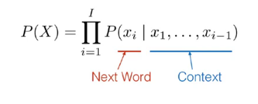
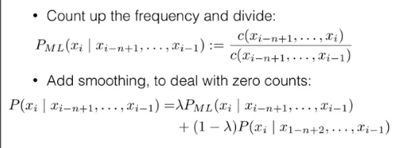
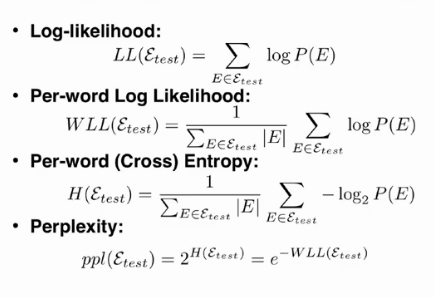
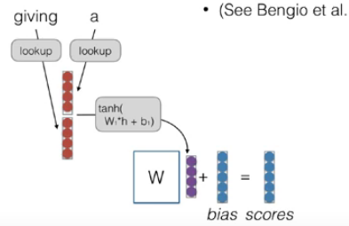
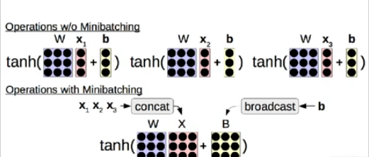

# Lecture 2 - Language Modeling, Efficiency/Training Tricks
# Key points
-  Sentences can be acceptable depending on the language.
- Note: lookup in the previous lecture meant as retrieving a single vector from a big matrix of word embeddings.
## Language Modeling
- Language Modeling is the calculating the probability of a sentence i.e the distribution of sentences that is how often they appear in the language.

- This is done by conditioning on the previous words, also called as an autoregressive manner of prediction.
- Problems with most language models include, cannot share strength among similar words, cannot condition on context with intervening words, Cannot handle long distance dependencies.
- Issues with linear models : Linear Models can't handle feature combinations, and an attempt to remember combinations as features results into explosion of features.
### Count Based Language Models
- The paper, "A bit of progress in language modeling", suggests this model.
- These are standard n-gram language models. The count of xi words is calculated and is then divided by the count of xi-1 words, to get the probability of the language model.

## Evaluation of language models
- Log-likelihood - Predict the probability of text.
- Per-word Log-likelihood
- Per word Cross Entropy - How small can you compress the dataset in a amount of bits
- Perplexity - Exponentiated entropy, The intuitive idea is, how many times would you have to randomly guess according to your probability distribution before you guess the next word correctly. (The lower the better)

## What can we do with LMs
- Scoring the coherence of a sentence.
- Language models as knowledge bases (Paper).
- Generate sentences based on either some pregiven context or randomly. (CTRL, GPT2 etc)
## Training a model
- Negative log likelihood, we take the probability of the correct element, we take its negative log and this corresponds to its loss.
- Trained through SGD.
## Notes on Vocabulary
- Problems faced include Unknown Words (can't have all words, larger vocabs need more memory)
- Comparison over different models can be done only when the vocabs are same, Can also be thought of as models must be able to generate the test set.
## Neural Language Models
- The input feature vectors are concatenated, multiplied with the weight matrix, put through non-linearities and added with bias to get a final vector and softmaxing over it.
- We can share parameters between input and output embeddings (Press et al 2016).

## Optimizers
- SGD: First calculates gradient of loss, subracts from previous parameters wrt to a learning rate. (better in terms of generalization Wilson et al 2017).
- SGD with momemtum - There's a rolling average of the gradients, called the momemtum, which is used to update the parameters.
- ADAGRAD - Changes the learning rate based on variance of gradients.
- THe problem with adagrad is that it continously decreases the learning rate, solved by using rolling average in ADADELTA and RMSprop.
- ADAM - Most standard optimization in NLP, Both rolling average of gradient and momemtum are considered. Correction of bias early in training.
- For more look at, Ruder et al 2016.

## Tips for training
- Shuffling the training Data
- Methods to prevent Overffiting - Early Stopping, Learning rate decay(learn how to use them, Denkowski & Neubig 2017), Patience.
- Dropout (Srivastava et al 2014) - Randomly zero-out nodes in the hidden layer with probability p at training time only. To stop the model from overfitting. Makes the task a harder learning problem. Two types - Standard and Inverted (scaled by p, scale by 1/(1-p)). Check out Dropconnect (Wan et al 2013.)
- Mini-Batching.

## Case Study
- AWD-LSTM (Merity et al 2017.)
