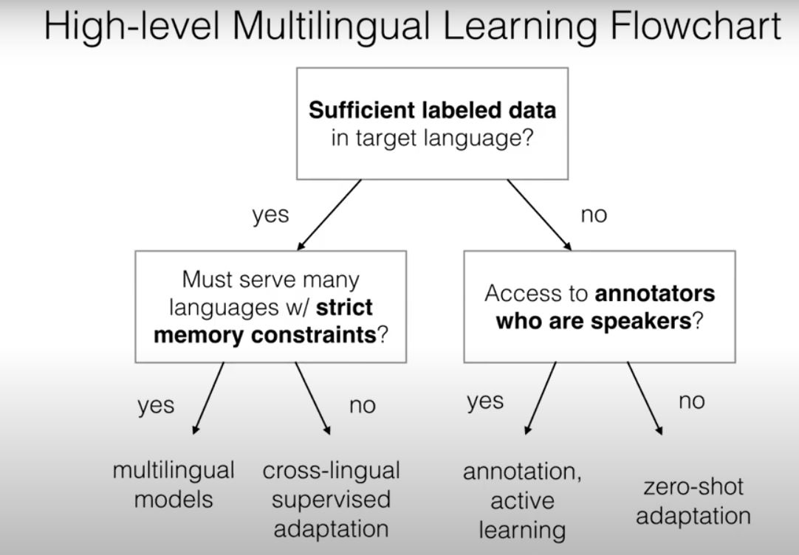

# Multitask  Learning
- Neural nets are feature extractors
- Methods for Multitask Learning
    - Standard Multi task Learning -> Train representations to do well on multiple tasks at once
    - Pretraining (Dai et al 2015)
        - Regularization for Pre-Training: Early Stopping, Explicit Regularization (L2), Dropout
    - Selective Parameter Adaptation : adapt only some of the parameters
- BERT Rediscovers the NLP pipeline 
- Domain Adaptation
    - Basically One task, but incoming data could be from very different distributions
    - Supervised: Pretrain on all data, finetune on domain data (luong et al 2015)
        - Train general domain and domain specific encoder and sum their results (kim et al 2016)
        - append a domain tag to input (chu et al 2016)
    - Unsupervised
        - No data in target, matching distribution and features

# Multilingual Learning
- Learn models that process multiple languages
    - Tranfer learning
    - Memory Saving

- Johnson et al 2016, Ha et al 2016
    - append language tags
- mBERT, XLM, XLM-R
    - Unsupervised models which concatenate monolingual corpora for all languages
    - XLM(TLM) -> Concatenate parallel sentences
- Difficulties 
    - Tradeoff between model capacity and no of languages
    - Siddhanth et al 2020, Aharoni et al 2020
- Data Balancing
    - Temperature based strategy to control ratio of samples from different languages.
- Data Augmentation
    - Lin et al 2019 -> method to select which language to transfer from a given language
    - Train a model on combined data (Fadee et al 2017, bergmanis et al 2017)
- If languages dont share script use pivot based morphological entity system (rijhwani et al)
- Zero shot Transfer to new Languages (Chen et al 2020)
    - Language adversarial networks to learn both language invariant and language specific features
- Data Creation, Active Learning (Chaudhary et al 2019)
    - Transfer and active learning
- Language Similarity helps in transfer learning.
