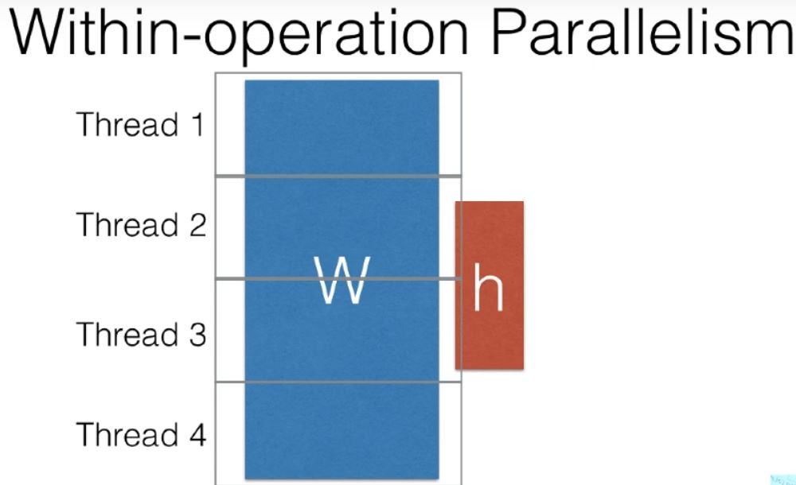
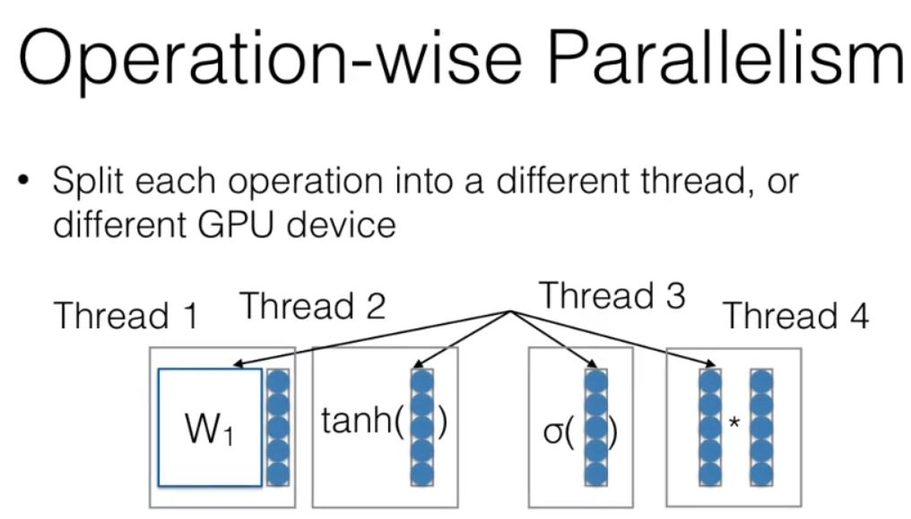
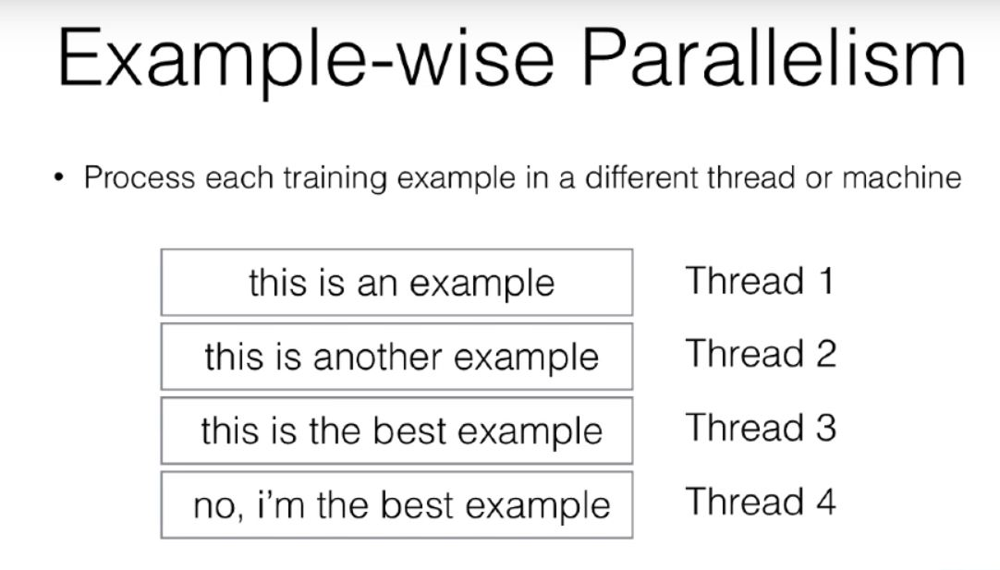

# Efficiency tricks for neural networks
- Reduce the number of operations through optimized batching. 
- Use parallelism, to increase large amoutn of data. 
- Big operations over multiple gpus. 
- CPUs can be used for prototyping, and is 

## Speed tricks
- Dont repeat operations.
- Reduce number of operations. 
- Reducing data movement from cpu to gpu. [Previous 3 come with practice of writing nets.]
- Memory is a major issue in GPU, upto 12GB. Therefore, you should minimize unnecessary operations over big piece of data. 

## Parallelism types of parallelism 
- Within-operation and operation-wise parallelism // Model Parallelism.

 
- Example-Wise Parallelism // Data parallelism.
    - Pytorch Distributed Data Parallel.
 

## Negative Sampling
- Computation is generally across large vocabs, So negative sampling samples examples according to some distribution q and we just calculate over these examples. 
### Importance Sampling
- Sample from an arbitrary distribution Q, and then reweight these samples to approximate denominator. 
### Noise Contrastive Estimation (Mnih & Teh 2012)
- Try to guess whether the sample being looked at is a true sample or one of the N random noise sampoles. 
- Simple Negative sampling (Mikolov et al 2012, Word2Vec). 
### MiniBatch Based Negative Sampling
- Select the same negative samples for each minibatch. 

## More efficient Predictors
## Structure based Approximations 
- Class based Softmax (Goodman 2001): Assign each word to a class, predict class first then word given class. CC : Square root of n
- Hierarchical Softmax (Morin and Bengio 2005):  Create a tree structure and make one decision at every node. CC : Log 2
- Binary Code Prediction (Oda et al 2017): Choose all bits in a single prediction. CC: log n, Problem with this - One error changes the word significantly. 
- Embedding Prediction (Kumar and Tsvetkov 2019): Predict embeddings directly, and take nearest words. Von-Mises Fisher Distribution Loss. [[Paper](https://arxiv.org/pdf/1812.04616.pdf)][[Review](https://github.com/Shashi456/Papers/blob/master/Review/VonMisesLoss.md)]
-   
