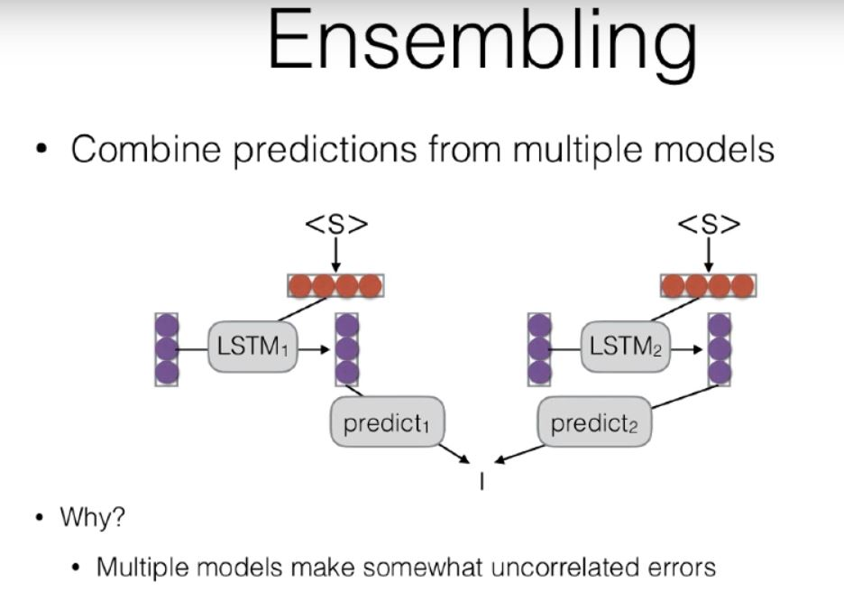

# Conditioned Generation 
- LMs are generative models of text. 
- Conditioned Language Models : Generate text according to some specification. Structure Data -> NL Description (NLG), English -> Japanese (MT), Document -> Short Description(Summ), Utterance -> Response(dialogue), Image -> Text(Image Captioning), Speech -> Transcript(Speech Recognition).
- Formulation : Predict the next word, given some additional context. 
- Encoder -> Decoder models, Conditioned LM , The encoder has some hidden state which is then used to initialize the initial hidden state of the decoder with this hidden state(Sutskever et al. 2014), this decoder can also be transformed before being initialized in the decoder.  

## Methods of Generation 
- The generation problem : We have a model of P(Y|X), how do we use it to generate a sentence. 
- Two methods:
    - Sampling : Generate a random sentence. (Gives you an idea of the distribution the model is learning)
    - Argmax: Generate the sentence with highest probability. (what the model think the most likely output is given the context).
- Sampling
    - Ancestral Sampling: Randomly generates words one by one 
- Search 
    - Greedy Search: Pick the single highest probability word. Problem is that it can fall into a local optima and never falling out of that. 
    - Beam Search : Instead of picking one high-probability word, maintain several paths. 
- If the model thinks that a wrong answer is correct then that is model error.
- If the model gives the right model score but the search cant find it, its a search error. 
- Greedy Search generally results in search errors. 
- You can have better outputs in three ways, by training the model to learn to output better, to have better search heuristics, and to have better length normalization techniques. 

## Model Ensembling 
- Combining predictions from multiple models. 

- Types of Ensembling 
    - Linear Interpolation: Take a weighted average of the M model probabilities. Favors any choice that a model gives a high probability to. Can be thought of as logical or, taking the highest probability word. 
    - Log-Linear Interpolation: Weighted combination of log probabilities. Favors cho ice where all models agree. Can be thought of logical and, taking the intersection of agreement of all models. 
- Works consistently across all tasks.
- Models can be as simply different as having different random seeds. 
- Ensemble Distillation(kim et al 2016): Knowledge distillation trains a model to copy the model. 
    - i.e it tries to match the distribution over the predicted words. 
    - Shown to increase accuracy notably.
- Parameter averaging is a cheap way to get some good effects of ensembling, towards the end of training, we save several models and take the average of parameters. 

## How do we Evaluate ?
- Use parallel test set, use system to generate outputs and compare target outputs with reference. 
- Human evaluation on basis of the likes of adequacy, fluency and if its better than the others. Or for summarization its coherence, relevance and fluency. 
- BLEU -> Works by comparing n-gram overlap w/ reference. 
- ROUGE -> Works by comparing n-gram overlap w/ reference.
- METEOR -> Like BLEU, ROUGE with many other tricks, considers paraphrases, reordering and function word/content word difference.
- Perplexity -> Calculater the perplexity of the words on a held out test set.
    - Perplexity - Exponentiated entropy, The intuitive idea is, how many times would you have to randomly guess according to your probability distribution before you guess the next word correctly. (The lower the better)
- Evaluating Unconditioned Generation: Not clear, We could do human evaluation but if the model memorizes the corpus its not good. 
    - Using perplexity is the best that can be done. 
    - Use conditioned generation. 

## Case Studies in Conditioned LM 
- From Structured Data (Wen et al 2015)
- Challenges in data to document generation (Wiseman et al 2017)
- From input + labels (Zhou and Neubig 2017)
- From Images (Karpathy et al 2015) 
