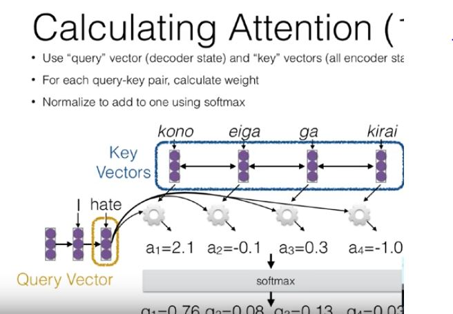
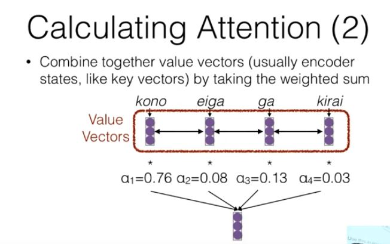

# Attention
- Sentence Representations -> Cramming the whole sentence into a single vector is not a good idea. 
- Attention (Bahadanau 2015 et al) -> Encode each word in the sentence into a vector, when decoding use combination of vectors to produce outputs. 

- For simple attention Query Vector -> Decoder State, Key Vector -> Encoder States, combine both of them with some function and then pass through softmax.

## Attention Score Functions
- *a(q, k) = w^T * tanh(W_1[q;k])* -> Original Paper MLP
- *a(q, k) = q^T * k* -> Dot Product
- *a(q, k) = q^T * W * k* -> Bilinear (luoung et al)
- *a(q, k) = q^T * k / sqrt(|k|)* -> Scaled Dot Product (Vaswani et al 2017)

## What do we attend to? 
- Input Sentence -> This is equivalent to copying. (Gu et al 2016)
- Input Sentence: Bias -> A generalization of the copy mechanism, If you have a translation dictionary, use it to bias outputs. (Arthur et al 2016.)
- Previously Generated things -> Attend to previous words (Merity et al 2016.)
    - In, translation attend to either input or previous input. (Vaswani et al 2017) 
    - These type of models are susceptible to exposure bias.
- Various Modalities: Images(Xu et al 2015), Speech etc
- Hierarchical Attention (Yang et al 2015): Encode progressively over higher levels, from words to sentences to documents. 
- Multiple Sources(Zoph et al 2015): Attend to multiple sentences while MT or documents while summarizing etc.  
    - Libovicky Helcl 2017 compare multiple strategies 
- Attend to a sentence and image (Huang et al 2016)
- Intra Attention (Cheng et al 2016) -> Each elements in the sentence attends to other elements, context sensitive encoding.  
- Coverage : Model how many times words have been covered. 
    - Cohn et al 2015 -> Impose a penalty if attention not approx 1 over words.
    - Mi et al 2016 -> Add embeddings indicating coverage.
- Incorporating Markov Properties (Cohn et al 2015)
- Bidirectional Training (Cohn et al 2015)
- Supervised Training (Mi et al 2016): Get gold standard alignments and train the model to match these strong alignments. 
- Attention is not Alignment (koegn and knowles 2017): Attention is often blurred/ partially distributed over multiple words. 

### Hard Attention 
- Instead of soft interpolation, make a zero-one decision about where to attend, harder to train (needs RL). (Xu et al 2015)
### Monotonic Attention
- In cases where we know output will be in the same order as the input. (Speech Recognition, Incremental Translation, Morphological Inflection/ Summarization)
### Multi Head Attention 
- Different heads for different levels of attention, (Can be semantically different kinds of attention or just can be plain but numerous.)
- Allamanis et al 2016 & Vaswani et al 2017

## Attention is all you need 
- A seq2seq model based entirely on attention. 
- Attention Tricks
    - Self Attention
    - Multi-Head Attention
    - Normalized Dot-product Attention (also slightly like bilinear)
- Positional Embeddings: Added to input or output embeddings, Can be learned or not, can also add a sinusoidal wave to distinguish position
- Training Tricks: 
    - Layer Normalization:  
    - Special Training Schedule 
    - Label Smoothing
    - Masking for efficient Training
    - Add residual connections between the layer 
- Masking: Perform training in as few operations as possible, this can be accomplished by masking the results of the output.
 