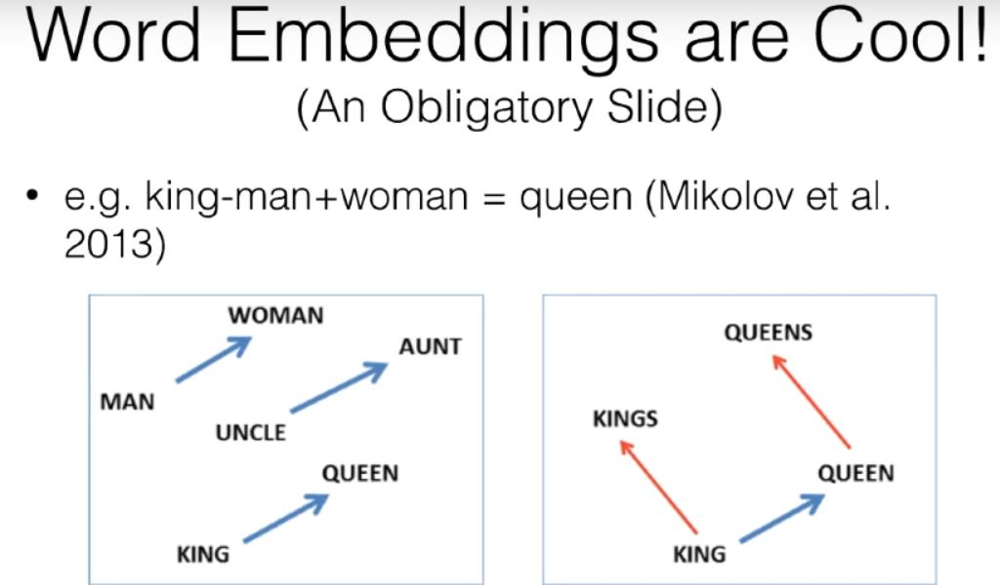
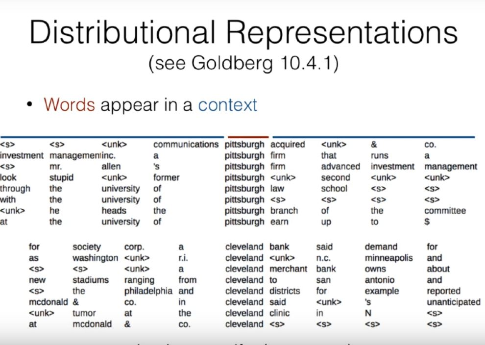

# Distributional Semantic and Word Vectors
- Training embeddings 
    -Initialize Randomly, train jointly with the task
    - Pre-train on a supervised task and test on another 
    - Pre-train on an unsupervised task, eg LM. 
## Word Representations (Non-contextualized)
- We want to know several things about words, about their conjugations, semantic relations and syntactic structures. 
- Non-contextualized representations, you calculate each word independently. 
- Contextualized word representations -> calculate for full task
- Wordnet -> Large database of words including speech and semantic relations.
- Word Embeddings 
    - Continous vector representation of words. 
    - Within the word embeddings, syntax and semantics may be included. 
- Word2Vec. (Mikolov et al 2013.)

- Distributional Representations -> Words are similar if they appear in similar contexts
    - Words appear in a context.

- Non-Distributional Representations-> Created from lexical resources
- Distributed Representations -> represented by a vector of values
- Local Representations -> Discrete symbols (One hot vector)

## Distributed Representations and ways to train them 
- Count-based methods: Count the number of co-occurences of words 
    - Levy and Goldberg 2014 : Strong connection between count-based methods and 
    prediction based methods.
- Predictions-based methods: Predict some task, word reps are byproducts of this task. 
- Context Window Methods : CBOW
### CBOW (Mikolov et al 2013)
- Predict word based on sum of surrounding embeddings. 
### SkipGram (Mikolov et al 2013)
- Predict each word in the context given the word. 
### Glove (Pennington et al 2014)
- A matrix factorization approach motivated by ratios of P(word|context) probabilities.
 

- How large should a context be?
    - Small Context Windows -> More syntax based embeddings
    - Large Context Windows -> More semantics based, topical embeddings. 

## Evaluation
- Intrinsic vs Extrinsic
- Qualitative vs Quantitative.

## Visualization of Embeddings
- Reduce High-Dimensional Embeddings into 2/3D for visualization (Mikolov et al) -> PCA
- Non-linear Projections (van der Maaten and hinton 2008)-> SNE/TSNE.  
    - t-SNE can be Misleading (Wattenberg et al 2015)

## Intrinsic Evaluation of Embeddings (Schnabel et al 2015)
- Relatedness
- Categorization
- Analogy

## Extrinsic Evaluation
- Initialize w/ the embeddings
- Concatenate pre-trained embeddings with learned embeddings. 

- Pretrained Embeddings are useful in tagging, parsing, text-classification etc, but less so in MT and usually not useful at all in LM

## How to improve Embeddings
### Limitation of Embeddings
- Sensitive to superficial differences.
- Not necessarily coordinated. 
- Not interpretable
### Sub word Embeddings
- Morpheme based (Luong et al 2013)
- Character-based (ling et al 2015)
- Bag-of-character n-grams (wieting et al 2016)
    - Use n-grams from 3-5 plus word itself.  
### Cross Lingual Word Embeddings
- Artexte et al 2017 -> Use identical words
- Faruqui et al 2014 -> You have two seperate embeddings and you bring them closer
- Zhang et al 2017 -> match Distributions 
### Sparse Embeddings
- Each dimension of a word embedding is not interpretable
- Add a sparsity constraint to increase the information content of non-zero dimensions for each word (Murphy et al 2012)
### De-biasing Word Embeddings (Bolukbasi et al 2016.)
- Word embeddings and in general deep learning models reflect bias in statistics.