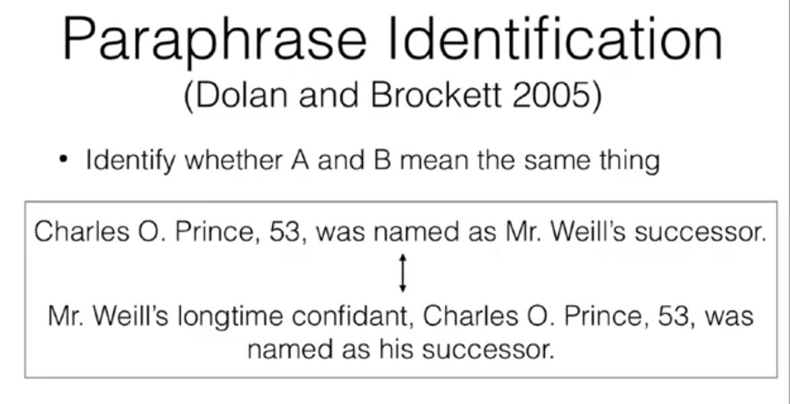

# Pretrained sentence and contextualized word representations
- Word Level embeddings and sentence level embeddings

## Tasks using Sentence Representations
- They are used in Sentence Classification, Paraphrase identification, NLI, retreival.
    - Semantic Similarity (Marelli et al 2014)

- Modeling for Sentence Pair Processing
    - Have some sentence representation and feed it into classifier.

## Multi-Task Learning
- Types of Learning
    - Multi Task Learning - Training on Multiple Tasks
    - Transfer Learning - Caring about one of the multiple tasks specifically.
    - Domain Adapation - Transfer Learning where the task is the same but different topics, like in summarization News, Story or Long Document.
- Rules of Thumb
    - Multitask learning is done increase data
    - Multitask learning works when your tasks are related, like sequence generation tasks or classification tasks. 
- Standard Multi Task Learning - Training representations to do weel on multiple tasks at once
- Pretraining - Train on one task then train on another.  
- Thinking about multi-tasking and pretrained representations 
    - Model: NN arch
    - Training Objective: What objective is used 
    - Data: What data is used

## Training Sentence Representations
- Language Model Transfer (Dai and Le 2015)
- OpenAI GPT (2018)
    - Model : Masked Self Attention, Transformer
    - Objective: Predict the next word left-> right
    - Data: Books Corpus
-  Context Prediction (Skip-thought vectors) Kiros et al 2015
    - Predicting the surrounding sentences with a LSTM
- ParaNMT Wieting and Gimpel 2018
- InferSent Conneau et al 2017

## Contextualized Word Representations
- Context2Vec - Melamud et al 2016
    - Use bidirectional LSTM to predict word given context (LM objective)
- ELMO (Peters et al)
    - MultiLayer Bidirectional LSTM used to individually predict the next word l->r, r->l
- BERT (Devlin et al 2018)
    - Transformer, Input sentence with CLS token, subword representation
    - Uses wordpiece
    - NSP + Masked Token Objective(Predict a masked word)
- RoBERTa
    - Like BERT
    - Trained longer, drop NSP
- Electra
    - Same as BERT
    - Instead of masking, replace the words. 
    - Generator -> Discriminator
    - Use the discriminator to check if original or replaced.

- XLNET
    - Autoregressive model
    - Permute all ways a sentence can exist and train model with LM on that.
